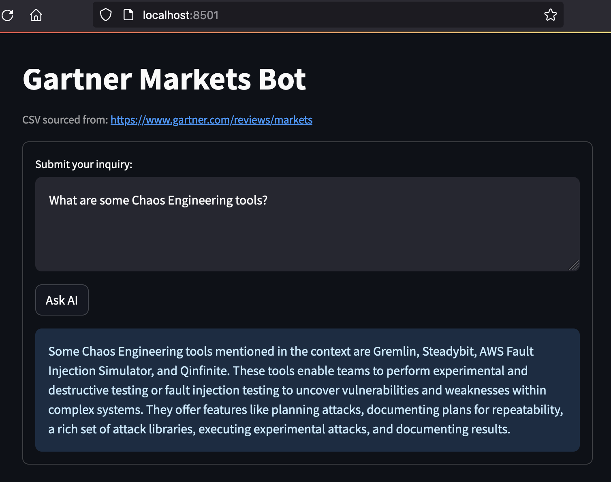

The popularity of AI and LLMs has raised questions and concerns among many industries and people. The cost to build and
train AI models is extravagant, to say the least. Many companies and products are purusing "General AI", or models that aim
to be "all-in-one", omniscient monoliths. On the other hand, "Narrow AI" is focused to a single-task or domain of knowledge.
There are tradeoffs but, in the enterprise setting, a domain-specific model will tend to outperform a general model for
performing explicit tasks and workflows within that domain. Additionally, _according to OWASP, retrieval-augmented generation (RAG)
models have "evolved into a more effective way of optimizing and augenting [LLMs]_ [(PDF)](https://owasp.org/www-project-top-10-for-large-language-model-applications/llm-top-10-governance-doc/LLM_AI_Security_and_Governance_Checklist-v1.pdf)".
As discussed below, the ability to run this LLM locally also means sensitive operations (such as those in finance, HR, legal, 
healthcare, etc) are enabled to use AI without fear of sending or exposing their training data, models, and/or outputs to
outside entities.

Ollama on Mac M1 silicon is a small, yet performent, LLM which enables quick iterations and prototyping of AI-enabled
applications capable of text summarization, content retrieval, and Q&A (among other cool AI techniques). Ollama allows us to 
build and run LLMs locally, like Hugging Face libraries; however, unlike Hugging Face (which run on PyTorch or TensorFlow),
Ollama uses llamma.cpp runtimes. See LangChain Docs [local LLMs](https://python.langchain.com/docs/guides/local_llms) and [Q&A models](https://python.langchain.com/docs/use_cases/question_answering/local_retrieval_qa).

Gartner RAG sends REST requests to the Ollama server through a very basic chat app. RAG is performed by langchain libraries
where a list of Gartner URLs are chunked and ingested into a chroma_db vectorstore where retrievals can then occur. Using
`ChatAi().ask` we can retreive answer contexts from the ingested URLs. This model uses [Mistral 7B](https://mistral.ai/news/announcing-mistral-7b/)
(Apache 2.0), and is extremely resource efficient / cost effective.

# gartner-rag
## STEP 1 - Env Setup
two options to get the env setup, `pip` & `venv` with `requirements.txt`, or just `poetry`:
```
### option 1
cd gartner-rag
brew install poetry; poetry install && poetry shell
```
### OR
```
### option 2
python3 -m venv .venv
source .venv/bin/activate
python3 -m pip install -r requirements.txt
```

## STEP 2 - Build vectorstore from CSV ingest
to initially build (or rebuild) the sklearn vectorstore
```
python3 -c 'import run_rag; run_rag.build()'
```

## STEP 3 - Run the web app
using `streamlit`
```
streamlit run webrag.py
```
`ctrl+c` to close the streamlit app


## Streamlit Example



## CLI Example
```
wesspinks@wspinks-mac langrag % python3
>>> import run_rag
>>> run_rag.chat()
Fetching 9 files: 100%|████████████████████████████████████████████████████████████████| 9/9 [00:00<00:00, 31352.77it/s]
>>> what is a warehouse management system?
 A Warehouse Management System (WMS) is a type of software application designed to support the
day-to-day operations and management of a warehouse or distribution center. It helps in managing and
tracking inventory, monitoring warehouse activities, and controlling the movement and storage of goods
within the warehouse. The main functions of a WMS include receiving and putaway, picking, packing,
shipping, inventory control, and reporting.

>>> is Luminate Logistics a warehouse management system?
 Yes, Luminate Logistics is a warehouse management system offered by DHL. It helps manage and
optimize inventory, orders,and shipping processes in real-time.

>>> what is Splunk IT Service Intelligence?
 Splunk IT Service Intelligence (ITSI) is a monitoring and analytics solution by Splunk that helps in
analyzing machine data to proactively detect and resolve IT service issues quicker. It uses AI and
machine learning for predictive analysis and correlating data from various sources, enabling IT teams to gain
real-time insights and improve the performance and availability of their IT services.
>>> /exit
>>> exit()
```
